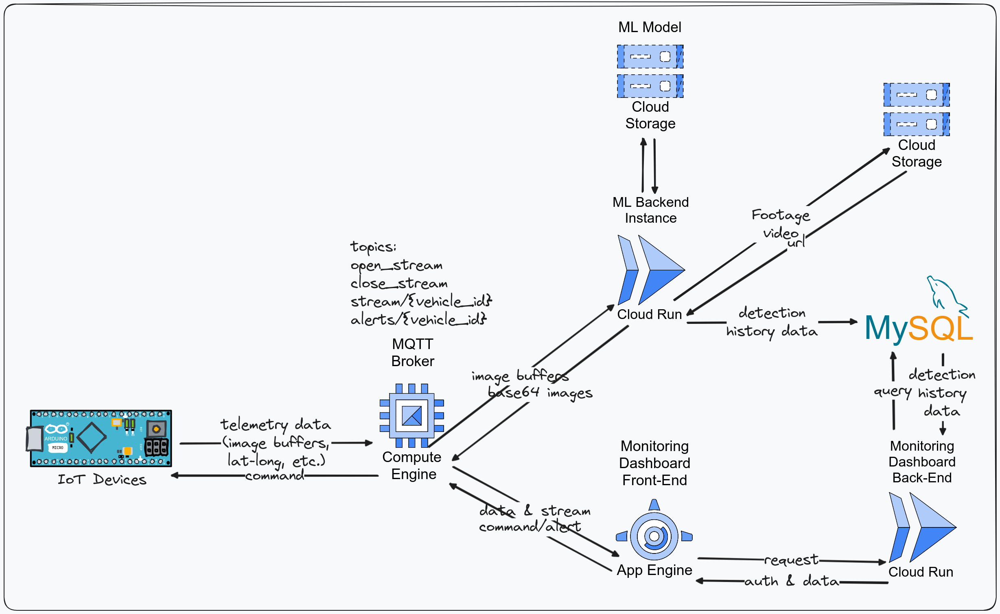

# [C241-MS01] Driver Monitoring System (DMS) | Braincore

We are Bangkit H1 2024 Company-Track Capstone Project Team collaborating with [Braincore](https://braincore.id/). This project contains the repositories for the Driver Monitoring System (DMS) project.

Driver Monitoring System (DMS) is a system that can detect the driver's condition while driving. This system can detect the driver's attention and detected objects in front of the driver. This system can be used to prevent accidents caused by the driver's condition while driving.

## System Architecture

## Team Members

| ID  | Name | Learning Path | University | Profile |
| ------------- | ------------- | ------------- | ------------- | ------------- |
| M011D4KY3011  | Muhammad Arya Revansyah   | ML | Universitas Padjadjaran | [LinkedIn](https://www.linkedin.com/in/muhammadaryarevansyah/) |
| M011D4KX1394  | Birgita Putri Grania Effendi  | ML | Universitas Padjadjaran | [LinkedIn](https://www.linkedin.com/in/birgita-putri-grania-effendi/) |
| M006D4KX1486  | Athirah Naura Rahmawati  | ML | Universitas Brawijaya | [LinkedIn](https://www.linkedin.com/in/athiraura/) |
| C006D4KY0741  | Bagas Hizbullah  | CC | Universitas Brawijaya | [LinkedIn](https://www.linkedin.com/in/bagas-hizbullah/) |
| C006D4KY0233  | Daiyan Uthsa Rafif  | CC | Universitas Brawijaya | [LinkedIn](https://www.linkedin.com/in/daiyanuthsa/) |
| C006D4KX0330  | Alifa Nurfika| CC | Universitas Brawijaya | [LinkedIn](https://www.linkedin.com/in/alifa-nurfika/) |
